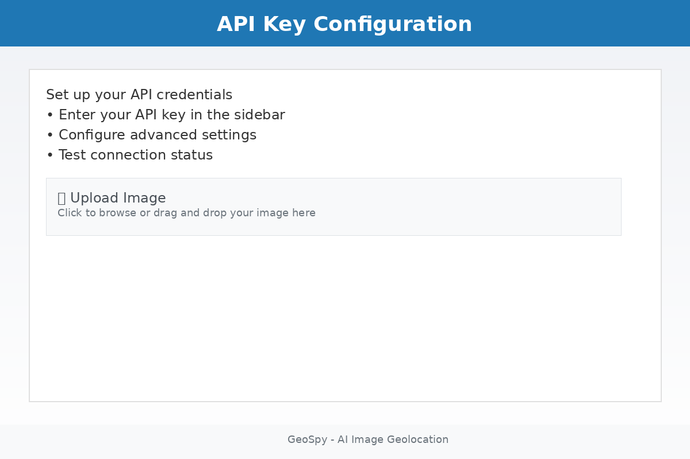
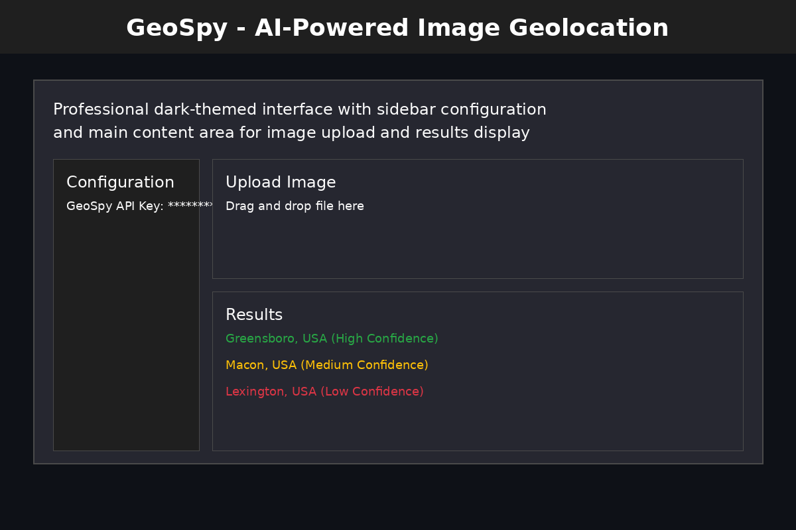
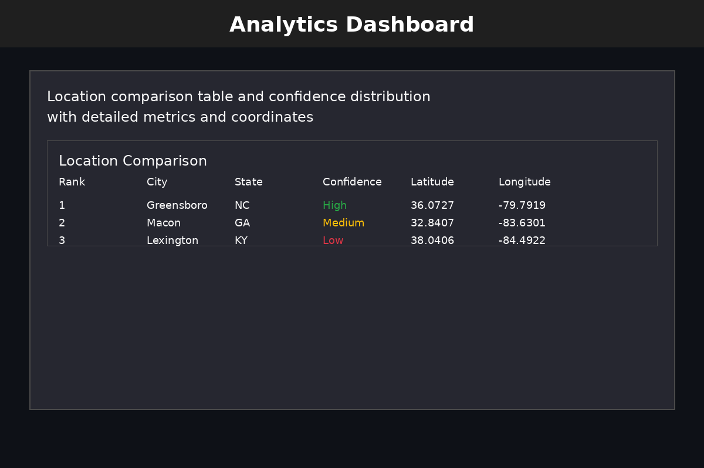
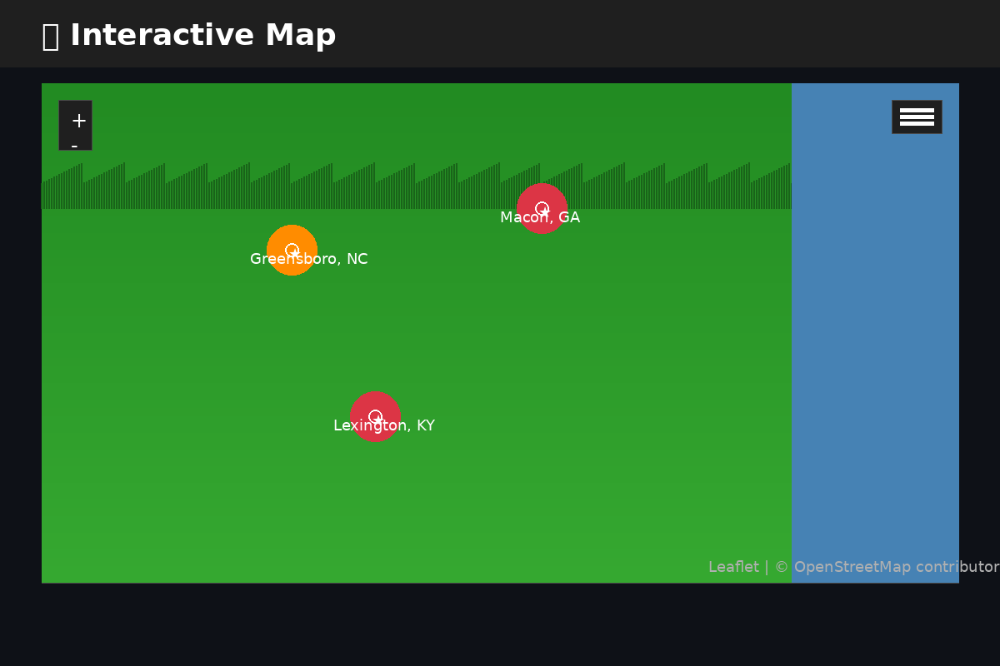
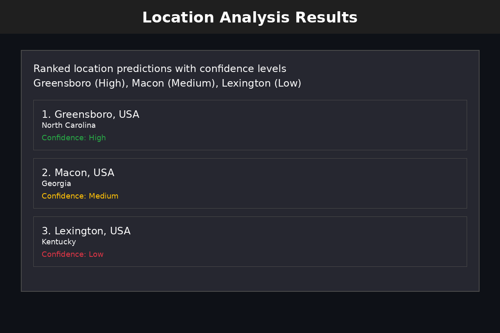
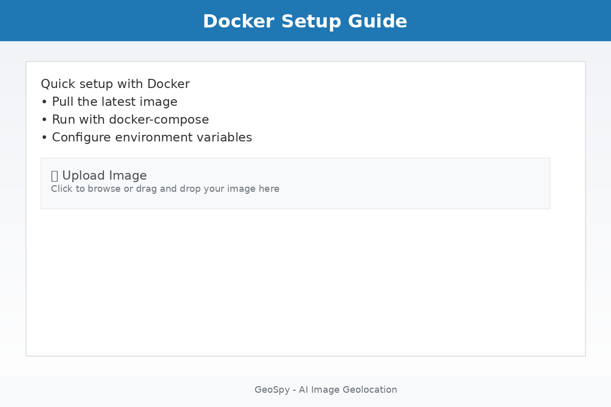

# 🌍 GeoSpy - AI-Powered Image Geolocation

[](https://www.docker.com/)
[](https://streamlit.io/)
[](https://python.org/)

> **Note**: This is an enhanced version of the original [GeoSpy](https://github.com/atiilla/geospy) project by [Atilla](https://github.com/atiilla), featuring a professional Streamlit web interface, Docker containerization, and improved user experience.

**GeoSpy** is an advanced AI-powered image geolocation tool that analyzes photographs to identify their geographical location. Using Google's Gemini AI, it examines architectural styles, environmental indicators, cultural context, and visual landmarks to provide multiple location predictions with confidence levels.

## ✨ Features

- 🏛️ **Architectural Analysis** - Identifies building styles, materials, and design patterns
- 🌿 **Environmental Indicators** - Analyzes vegetation, climate, and natural features
- 🚗 **Cultural Context** - Recognizes signs, vehicles, and cultural elements
- 📍 **Multiple Predictions** - Provides 3-5 ranked location options with confidence levels
- 🗺️ **Interactive Maps** - Visualizes predictions with satellite and street views
- 📊 **Confidence Analytics** - Detailed confidence scoring and feature analysis
- 🏆 **Location Rankings** - Gold, silver, bronze ranking system for predictions
- 🔄 **Automatic Retry** - Handles API overload and temporary failures gracefully
- 🛡️ **Error Recovery** - Comprehensive error handling with user guidance

## 🚀 Quick Start

### Option 1: Docker (Recommended)

```bash
# Clone the repository
git clone https://github.com/jefrya123/Geospyfront.git
cd Geospyfront

# Set your API key
export GEMINI_API_KEY="your_api_key_here"

# Start the application
docker-compose up --build

# Open your browser to: http://localhost:8502
```

### Option 2: Local Development

```bash
# Clone and setup
git clone https://github.com/jefrya123/Geospyfront.git
cd Geospyfront

# Create virtual environment
python -m venv venv
source venv/bin/activate  # On Windows: venv\Scripts\activate

# Install dependencies
pip install -r requirements.txt

# Set API key
export GEMINI_API_KEY="your_api_key_here"

# Run the app
streamlit run streamlit_app_clean.py
```

## 🔑 API Key Setup

1. **Get Your API Key:**
   - Visit [Google AI Studio](https://makersuite.google.com/app/apikey)
   - Create a new API key (free tier available)
   - Copy the key to your clipboard

2. **Set Environment Variable:**
   ```bash
   export GEMINI_API_KEY="your_actual_api_key_here"
   ```

> **⚠️ Security Note**: Each user needs their own API key. Never share your API key publicly or commit it to version control.

## 📸 Screenshots

<div align="center">
  
  
  
  
  
  
</div>

## 🏗️ Architecture

```
┌─────────────────┐    ┌─────────────────┐    ┌─────────────────┐
│   Streamlit UI  │───▶│   GeoSpy Core   │───▶│  Gemini API     │
│                 │    │                 │    │                 │
│ • File Upload   │    │ • Image Encoding│    │ • AI Analysis   │
│ • Interactive   │    │ • API Requests  │    │ • Location      │
│   Maps          │    │ • Error Handling│    │   Prediction    │
│ • Analytics     │    │ • Retry Logic   │    │ • Confidence    │
└─────────────────┘    └─────────────────┘    └─────────────────┘
```

## 🛠️ Technology Stack

- **Frontend**: Streamlit, HTML/CSS, JavaScript
- **Backend**: Python 3.11+
- **AI/ML**: Google Gemini API
- **Maps**: Folium, OpenStreetMap, Esri Satellite
- **Data Visualization**: Plotly, Pandas, NumPy
- **Containerization**: Docker, Docker Compose
- **Image Processing**: Pillow (PIL)

## 🔍 How It Works

1. **Image Upload**: Users upload images or provide URLs
2. **AI Analysis**: Gemini AI analyzes visual elements:
   - Architectural features and building styles
   - Environmental indicators (vegetation, climate)
   - Cultural context (signs, vehicles, people)
   - Landmarks and distinctive features
3. **Location Prediction**: AI generates 3-5 possible locations with confidence levels
4. **Visualization**: Results displayed on interactive maps with analytics
5. **Ranking**: Locations ranked by confidence (gold, silver, bronze)

## ⚙️ Configuration

### Environment Variables

| Variable | Description | Required | Default |
|----------|-------------|----------|---------|
| `GEMINI_API_KEY` | Your Gemini API key | Yes | None |

### Docker Configuration

The application runs on port 8502 by default. You can modify `docker-compose.yml` to change the port mapping:

```yaml
ports:
  - "YOUR_PORT:8501"  # Change YOUR_PORT to desired host port
```

## 📊 Performance & Limitations

### ⚡ Performance
- **Analysis Time**: 5-15 seconds per image
- **Image Size**: Supports up to 20MB images
- **Formats**: PNG, JPG, JPEG, GIF, BMP
- **Concurrent Users**: Limited by Gemini API rate limits

### 🎯 Accuracy Limitations

**AI Predictions May Be Incorrect:**
- **Visual Similarity**: AI may confuse similar-looking locations
- **Generic Landscapes**: Plain landscapes are harder to identify
- **Indoor Photos**: Limited to architectural and cultural clues
- **Edited Images**: Filters, crops, or edits can affect accuracy
- **Historical Changes**: AI may not recognize recent changes to locations

**Common Accuracy Issues:**
- Similar architectural styles across regions
- Generic urban environments
- Rural areas with limited distinctive features
- Photos with poor lighting or quality
- Locations with recent development changes

### 🔄 API Reliability

**Free API Constraints:**
- **Rate Limits**: Limited requests per minute/hour
- **Quota Limits**: Monthly usage limits apply
- **Service Availability**: May experience temporary outages
- **Peak Traffic**: Performance may degrade during high usage

**Error Handling:**
- **Automatic Retries**: 3 attempts with exponential backoff
- **503 Errors**: API overload - retry with delays
- **429 Errors**: Rate limiting - longer delays
- **Timeout Handling**: 30-second timeout per request

## 🚨 Troubleshooting

### Common Issues

**API Key Problems:**
```bash
# Check if API key is set
echo $GEMINI_API_KEY

# Set API key if missing
export GEMINI_API_KEY="your_key_here"
```

**Port Already in Use:**
```bash
# Check what's using port 8502
lsof -i :8502

# Kill process or change port in docker-compose.yml
```

**Docker Issues:**
```bash
# Clean up Docker
docker-compose down
docker system prune -f
docker-compose up --build
```

**API Overload (503 Error):**
- Wait 1-2 minutes and retry
- Try during off-peak hours
- Check [Google AI Studio Status](https://status.ai.google.com/)

### Error Messages

| Error | Cause | Solution |
|-------|-------|----------|
| "API key required" | Missing API key | Set `GEMINI_API_KEY` environment variable |
| "API overloaded" | High traffic | Wait and retry, or try later |
| "Rate limit exceeded" | Too many requests | Wait for rate limit reset |
| "Invalid API key" | Wrong key | Check and regenerate API key |
| "Request timeout" | Network issues | Check internet connection |

## 📖 How to Use

### 1. **Upload Image**
   - Drag and drop an image file
   - Or provide a direct image URL
   - Supported formats: PNG, JPG, JPEG, GIF, BMP

### 2. **Configure Analysis**
   - Enter your Gemini API key
   - Add optional context (time, weather, landmarks)
   - Provide location hints if available

### 3. **Analyze Location**
   - Click "Analyze Location" button
   - Wait 5-15 seconds for AI processing
   - View multiple location predictions

### 4. **Explore Results**
   - Review ranked location predictions
   - Examine confidence levels and reasoning
   - Explore interactive maps
   - View analytics and comparisons

## 🤝 Contributing

We welcome contributions! Please see our [Contributing Guidelines](CONTRIBUTING.md) for details.

### Development Setup

```bash
# Fork and clone
git clone https://github.com/yourusername/Geospyfront.git
cd Geospyfront

# Install development dependencies
pip install -r requirements.txt
pip install -r requirements-dev.txt

# Run tests
pytest

# Start development server
streamlit run streamlit_app_clean.py
```

## 📄 License

This project is licensed under the MIT License - see the [LICENSE](LICENSE) file for details.

## 🙏 Acknowledgments

- **Original Project**: This project is based on [GeoSpy](https://github.com/atiilla/geospy) by [Atilla](https://github.com/atiilla)
- **AI Technology**: Powered by Google's Gemini API
- **Maps**: OpenStreetMap and Esri for satellite imagery
- **UI Framework**: Streamlit for the web interface

## 💬 Support

- **Issues**: [GitHub Issues](https://github.com/jefrya123/Geospyfront/issues)
- **Discussions**: [GitHub Discussions](https://github.com/jefrya123/Geospyfront/discussions)
- **Email**: jefrya123@gmail.com

## 🗺️ Roadmap

- [ ] **Batch Processing** - Analyze multiple images at once
- [ ] **Historical Analysis** - Compare with historical location data
- [ ] **Custom Models** - Train on specific geographic regions
- [ ] **Mobile App** - Native iOS/Android applications
- [ ] **API Endpoints** - RESTful API for integration
- [ ] **Advanced Analytics** - Detailed confidence scoring
- [ ] **Community Database** - User-contributed location data

---

**⭐ Star this repository if you find it helpful!**

**🔗 Repository**: [https://github.com/jefrya123/Geospyfront](https://github.com/jefrya123/Geospyfront)