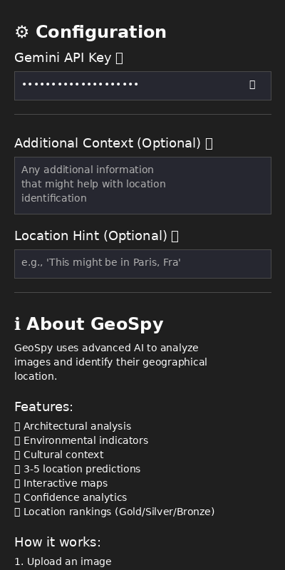

# 🌍 GeoSpy - AI-Powered Image Geolocation

[](https://www.docker.com/)
[](https://streamlit.io/)
[](https://python.org/)

> **Note**: This is an enhanced version of the original [GeoSpy](https://github.com/atiilla/geospy) project by [Atilla](https://github.com/atiilla), featuring a professional Streamlit web interface, Docker containerization, and improved user experience.

**GeoSpy** is an advanced AI-powered image geolocation tool that analyzes photographs to identify their geographical location. Using Google's Gemini AI, it examines architectural styles, environmental indicators, cultural context, and visual landmarks to provide **3-5 ranked location predictions** with confidence levels.

## ✨ Features

- 🏛️ **Architectural Analysis** - Identifies building styles, materials, and design patterns
- 🌿 **Environmental Indicators** - Analyzes vegetation, climate, and natural features
- 🚗 **Cultural Context** - Recognizes signs, vehicles, and cultural elements
- 📍 **Multiple Predictions** - Provides **3-5 ranked location options** with confidence levels
- 🗺️ **Interactive Maps** - Visualizes predictions with satellite and street views
- 📊 **Confidence Analytics** - Detailed confidence scoring and feature analysis
- 🏆 **Location Rankings** - Gold, silver, bronze ranking system for predictions
- 🔄 **Automatic Retry** - Handles API overload and temporary failures gracefully
- 🛡️ **Error Recovery** - Comprehensive error handling with user guidance

## 🚀 Quick Start

### Option 1: Docker (Recommended)

```bash
# Clone the repository
git clone https://github.com/jefrya123/Geospyfront.git
cd Geospyfront

# Start the application
docker-compose up --build

# Open your browser to: http://localhost:8502
```

### Option 2: Local Development

```bash
# Clone and setup
git clone https://github.com/jefrya123/Geospyfront.git
cd Geospyfront

# Create virtual environment
python -m venv venv
source venv/bin/activate  # On Windows: venv\Scripts\activate

# Install dependencies
pip install -r requirements.txt

# Run the app
streamlit run streamlit_app_clean.py
```

## 🔑 API Key Setup

1. **Get Your API Key:**
   - Visit [Google AI Studio](https://makersuite.google.com/app/apikey)
   - Create a new API key (free tier available)
   - Copy the key to your clipboard

2. **Enter API Key in App:**
   - Start the application (Docker or local)
   - Open the sidebar configuration panel
   - Enter your API key in the "Gemini API Key" field
   - The key is securely stored in your session

> **⚠️ Security Note**: Each user needs their own API key. The API key is stored securely in your browser session and is never saved to disk or shared.

## 📸 User Journey - See GeoSpy in Action

Follow this visual story to see how GeoSpy transforms any image into precise location predictions:

### 🚀 **Step 1: Getting Started**
<div align="center">
  
  
</div>

**What you see:** Simple Docker deployment and secure API key entry in the sidebar configuration panel.

---

### 📸 **Step 2: Upload & Analyze**
<div align="center">
  
</div>

**What you see:** Clean, professional interface where you can upload images or provide URLs for analysis.

---

### 🏆 **Step 3: Top 3 Predictions**
<div align="center">
  
</div>

**What you see:** AI-powered analysis showing the top 3 most likely locations with detailed reasoning for each prediction.

---

### 📊 **Step 4: Analytics Dashboard**
<div align="center">
  
  
</div>

**What you see:** Detailed analytics showing location comparisons, coordinates, and confidence distribution charts.

---

### 🗺️ **Step 5: Interactive Maps**
<div align="center">
  
</div>

**What you see:** Interactive satellite map with markers for each predicted location, allowing you to explore the areas visually.

---

### ⚠️ **Step 6: Error Handling**
<div align="center">
  
</div>

**What you see:** Professional error handling when the API is overloaded, with clear guidance on what to do next.

---

### 🎯 **The Complete Experience:**
- **Easy Setup**: Docker deployment with secure API key entry
- **Simple Upload**: Drag-and-drop or URL-based image upload
- **AI Analysis**: Advanced image analysis with top 3 location predictions
- **Rich Results**: Detailed reasoning, coordinates, and confidence metrics
- **Visual Exploration**: Interactive maps and analytics dashboards
- **Professional UX**: Dark theme with responsive design and error handling

## 🏗️ Architecture

```
┌─────────────────┐    ┌─────────────────┐    ┌─────────────────┐
│   Streamlit UI  │───▶│   GeoSpy Core   │───▶│  Gemini API     │
│                 │    │                 │    │                 │
│ • File Upload   │    │ • Image Encoding│    │ • AI Analysis   │
│ • Interactive   │    │ • API Requests  │    │ • Location      │
│   Maps          │    │ • Error Handling│    │   Prediction    │
│ • Analytics     │    │ • Retry Logic   │    │ • Confidence    │
└─────────────────┘    └─────────────────┘    └─────────────────┘
```

## 🛠️ Technology Stack

- **Frontend**: Streamlit, HTML/CSS, JavaScript
- **Backend**: Python 3.11+
- **AI/ML**: Google Gemini API
- **Maps**: Folium, OpenStreetMap, Esri Satellite
- **Data Visualization**: Plotly, Pandas, NumPy
- **Containerization**: Docker, Docker Compose
- **Image Processing**: Pillow (PIL)

## 🔍 How It Works

Follow this step-by-step process to see how GeoSpy analyzes your images:

### **Step 1: Setup & Configuration**
- **Deploy the application** using Docker or local installation
- **Enter your API key** securely in the sidebar configuration panel
- **Prepare your image** (PNG, JPG, JPEG, GIF, BMP up to 20MB)

### **Step 2: Image Analysis**
- **Upload your image** via drag-and-drop or provide a direct URL
- **AI Processing**: Gemini AI analyzes visual elements:
  - 🏛️ **Architectural features** and building styles
  - 🌿 **Environmental indicators** (vegetation, climate, terrain)
  - 🚗 **Cultural context** (signs, vehicles, people, language)
  - 🗺️ **Landmarks** and distinctive features
  - 🏙️ **Urban patterns** and city layouts

### **Step 3: Location Prediction**
- **AI generates top 3 location predictions** with detailed reasoning
- **Each prediction includes**:
  - 📍 Precise coordinates (latitude/longitude)
  - 🏙️ City, state, and country information
  - 💡 Detailed AI reasoning for the prediction
  - 📊 Confidence metrics and analysis

### **Step 4: Results Visualization**
- **Interactive maps** with satellite view and location markers
- **Analytics dashboard** with comparison tables and charts
- **Detailed reasoning** for each prediction
- **Export capabilities** for further analysis

### **Step 5: Error Handling**
- **Graceful API overload handling** with retry guidance
- **User-friendly error messages** with clear solutions
- **Rate limit management** and best practices

## ⚙️ Configuration

### API Key Setup

The application uses a secure sidebar interface for API key entry:

1. **Start the application** (Docker or local)
2. **Open the sidebar** (⚙️ Configuration panel)
3. **Enter your Gemini API key** in the password field
4. **The key is stored securely** in your browser session

### Docker Configuration

The application runs on port 8502 by default. You can modify `docker-compose.yml` to change the port mapping:

```yaml
ports:
  - "YOUR_PORT:8501"  # Change YOUR_PORT to desired host port
```

## 📊 Performance & Limitations

### ⚡ Performance
- **Analysis Time**: 5-15 seconds per image
- **Image Size**: Supports up to 20MB images
- **Formats**: PNG, JPG, JPEG, GIF, BMP
- **Concurrent Users**: Limited by Gemini API rate limits

### 🎯 Accuracy Limitations

**AI Predictions May Be Incorrect:**
- **Visual Similarity**: AI may confuse similar-looking locations
- **Generic Landscapes**: Plain landscapes are harder to identify
- **Indoor Photos**: Limited to architectural and cultural clues
- **Edited Images**: Filters, crops, or edits can affect accuracy
- **Historical Changes**: AI may not recognize recent changes to locations

**Common Accuracy Issues:**
- Similar architectural styles across regions
- Generic urban environments
- Rural areas with limited distinctive features
- Photos with poor lighting or quality
- Locations with recent development changes

### 🔄 API Reliability

**Free API Constraints:**
- **Rate Limits**: Limited requests per minute/hour
- **Quota Limits**: Monthly usage limits apply
- **Service Availability**: May experience temporary outages
- **Peak Traffic**: Performance may degrade during high usage

**Error Handling:**
- **Automatic Retries**: 3 attempts with exponential backoff
- **503 Errors**: API overload - retry with delays
- **429 Errors**: Rate limiting - longer delays
- **Timeout Handling**: 30-second timeout per request

## 🚨 Troubleshooting

### Common Issues

**API Key Problems:**
```bash
# The API key is entered in the Streamlit sidebar
# No environment variable setup required

# If you see "API key required" error:
# 1. Check the sidebar configuration panel
# 2. Enter your Gemini API key in the password field
# 3. Make sure the key is valid and active
```

**Port Already in Use:**
```bash
# Check what's using port 8502
lsof -i :8502

# Kill process or change port in docker-compose.yml
```

**Docker Issues:**
```bash
# Clean up Docker
docker-compose down
docker system prune -f
docker-compose up --build
```

**API Overload (503 Error):**
- Wait 1-2 minutes and retry
- Try during off-peak hours
- Check [Google AI Studio Status](https://status.ai.google.com/)

### Error Messages

| Error | Cause | Solution |
|-------|-------|----------|
| "API key required" | Missing API key | Enter API key in sidebar configuration |
| "API overloaded" | High traffic | Wait and retry, or try later |
| "Rate limit exceeded" | Too many requests | Wait for rate limit reset |
| "Invalid API key" | Wrong key | Check and regenerate API key |
| "Request timeout" | Network issues | Check internet connection |

## 📖 How to Use

### 1. **Upload Image**
   - Drag and drop an image file
   - Or provide a direct image URL
   - Supported formats: PNG, JPG, JPEG, GIF, BMP

### 2. **Configure Analysis**
   - Enter your Gemini API key
   - Add optional context (time, weather, landmarks)
   - Provide location hints if available

### 3. **Analyze Location**
   - Click "Analyze Location" button
   - Wait 5-15 seconds for AI processing
   - View **3-5 ranked location predictions**

### 4. **Explore Results**
   - Review **ranked location predictions** (🥇 Gold, 🥈 Silver, 🥉 Bronze)
   - Examine confidence levels and detailed reasoning
   - Explore interactive maps with multiple markers
   - View analytics and location comparison table

## 🤝 Contributing

We welcome contributions! Please see our [Contributing Guidelines](CONTRIBUTING.md) for details.

### Development Setup

```bash
# Fork and clone
git clone https://github.com/yourusername/Geospyfront.git
cd Geospyfront

# Install development dependencies
pip install -r requirements.txt
pip install -r requirements-dev.txt

# Run tests
pytest

# Start development server
streamlit run streamlit_app_clean.py
```

## 📄 License

This project is licensed under the MIT License - see the [LICENSE](LICENSE) file for details.

## 🙏 Acknowledgments

- **Original Project**: This project is based on [GeoSpy](https://github.com/atiilla/geospy) by [Atilla](https://github.com/atiilla)
- **AI Technology**: Powered by Google's Gemini API
- **Maps**: OpenStreetMap and Esri for satellite imagery
- **UI Framework**: Streamlit for the web interface

## 💬 Support

- **Issues**: [GitHub Issues](https://github.com/jefrya123/Geospyfront/issues)
- **Discussions**: [GitHub Discussions](https://github.com/jefrya123/Geospyfront/discussions)
- **Email**: jefrya123@gmail.com

## 🗺️ Roadmap

- [ ] **Batch Processing** - Analyze multiple images at once
- [ ] **Historical Analysis** - Compare with historical location data
- [ ] **Custom Models** - Train on specific geographic regions
- [ ] **Mobile App** - Native iOS/Android applications
- [ ] **API Endpoints** - RESTful API for integration
- [ ] **Advanced Analytics** - Detailed confidence scoring
- [ ] **Community Database** - User-contributed location data

---

**⭐ Star this repository if you find it helpful!**

**🔗 Repository**: [https://github.com/jefrya123/Geospyfront](https://github.com/jefrya123/Geospyfront)